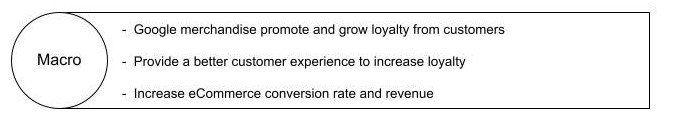
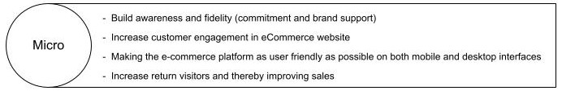
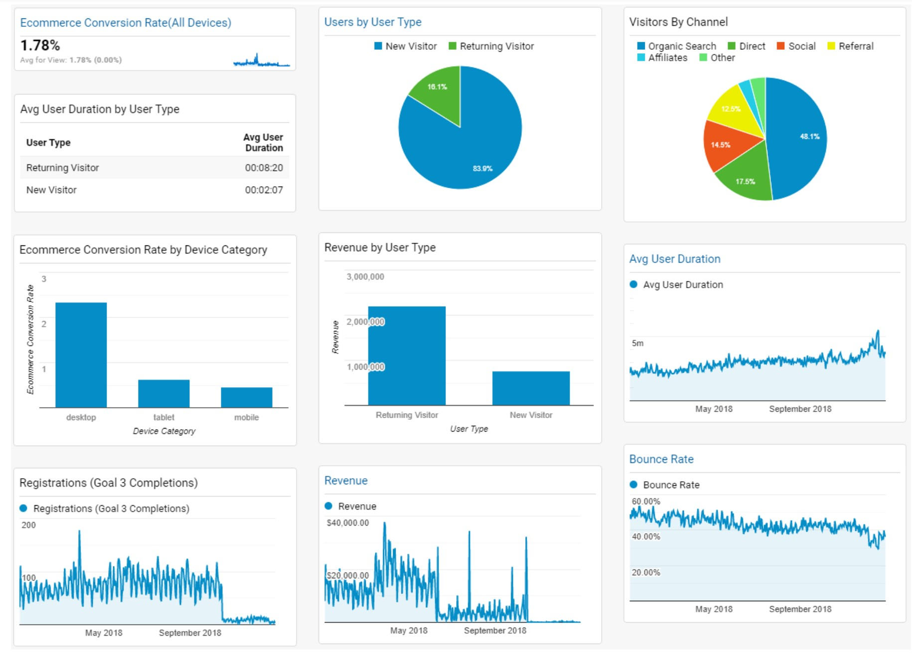

# Website Analysis - Google Merchandise Store

### Team 15 

- Nazneen Cohen
- Jisung Jung
- Javier Orjuela
- Ektor Papaellinas.

## Executive Summary

The objective of this report is to provide an analysis of the Google Merchandise Store, an e-commerce site that sells Google-branded merchandise. This report examines goals, performance, and results of this platform during the year 2018 and makes proposed recommendations that this website can use to improve their performances in the macro and micro goals established by our team. 

One of the main goals of the google merchandise store we have identified is promote their merchandise and promote loyalty to the brand. Combined with seamless customer experience, the Google merchandise store can make a significant increase in brand loyalty and sales. One of the key insights our team found was when comparing Desktop to other device categories, Mobile and Tablet that have a much lower user engagement, session duration, registration rate, and higher bounce rate of around 51%. Furthermore, the e-commerce conversion rate for Desktop (2.31%), Mobile (0.46%), and Tablet (0.59%) shows a lot of disparity which means that the mobile/tablet version needs some optimization to ensure that the user experience is as good as the desktop experience. 

One of the most useful insights learned from our analysis is that returning users accounted for 74.23% of the website's total revenue but only accounted for 16.11% of the total number of users. This insight tells us that when optimizing for revenue, the returning users are the most important customers for the google merchandise store and that this segment can then be further retargeted with more niche marketing campaigns.

## Strategies and Tactics

## Digital Analytics Measurement Model (DAMM)

The Digital Analytics Measurement Model, also known as DAMM summarizes business and website objectives in order to convert them into measurable metrics. These metrics correlate with the managerial goals of the company and assess the effectiveness of its digital performance over time with a high level of accuracy. The table below provides details of the model, according to the three different areas of Digital Marketing.

<table align="left">
<thead>
  <tr>
    <th>DAMM Steps</th>
    <th>Acquisition</th>
    <th>Behavior</th>
    <th>Conversions</th>
  </tr>
</thead>
<tbody>
  <tr>
    <td><b>Business Objectives</b></td>
    <td>Google merchandise promote and grow loyalty from customers</td>
    <td>Provide a better customer experience to increase loyalty</td>
    <td>Increase e-commerce conversion rate and revenue</td>
  </tr>
  <tr>
    <td><b>Website Goals</b></td>
    <td>Build awareness and fidelity (commitment and brand support)</td>
    <td>Increase customer engagement in eCommerce website</td>
    <td>Making the eCommerce platform as user friendly as possible on both mobile and desktop interfaces  Increase return visitors and thereby improving sales</td>
  </tr>
  <tr>
    <td><b>KPIs</b></td>
    <td>1. Organic sessions 2. Return visitors</td>
    <td>3. Bounce rate 4. Avg. session &nbsp;&nbsp;&nbsp;&nbsp;duration</td>
    <td>5. Ecommerce conversion &nbsp;&nbsp;&nbsp;&nbsp;rate 6. Registrations rate 7. Ecommerce conversion &nbsp;&nbsp;&nbsp;&nbsp;rate w/ tablet and mobile</td>
  </tr>
  <tr>
    <td><b>Targets</b></td>
    <td>1. Organic sessions increase to 55% (Current: 45.22%)  2. Return visitors increase to 20% (Current: 16.1%)</td>
    <td>3. Bounce rate reduce to 35% (Current: 43.46%)  4. Avg. session time &nbsp;i) New users &nbsp;&nbsp;&nbsp;&nbsp;increase by 15 secs &nbsp;&nbsp;&nbsp;&nbsp;(Current 129 secs) &nbsp;ii) Returning users &nbsp;&nbsp;&nbsp;&nbsp;increase by 25 secs &nbsp;&nbsp;&nbsp;&nbsp;(Current 218 secs)</td>
    <td>5. Desktop conversion rate increase to 3% (Current: 2.31%)  6. Registrations rate increase to 3.5% (Current: 2.3%)  7. Mobile&Tablet conversion rate increase to 1% (Current 0.46%, 0.59%)</td>
  </tr>
  <tr>
    <td><b>Segments</b></td>
    <td>1. Organic search &nbsp;&nbsp;&nbsp;&nbsp;user. 2. Users by user type.</td>
    <td>3. Returning user 4. Seconds per session</td>
    <td>5. Purchases 6. Registrations 7. Mobile and Tablet &nbsp;&nbsp;&nbsp;&nbsp;Conversion rate</td>
  </tr>
</tbody>
</table>

## Key Performance Indicators (KPI’s)

Google Analytics has a range of Key Performance Indicators (KPIs). These different metrics give you a detailed view of different information related to your site and how your users interact with it. These KPIs can be used to analyze all the data, adapt, and fine-tune how users behave on your site.

I.  Acquisition

- Organic sessions

  This KPI tells you the number of visitors who come to your site through organic search results. The current number of visitors that Google analytics shows is 45.22% (total of 986,722). This percentage could be increased because the name of the brand is well recognized and with a little improvement in promotions this number would increase to 55% or more. 

- Return Visitors

  This KPI shows you how loyal visitors to your website are. A return visitor is someone who is returning to your website after they have initiated another session on the same browser or the same device.

  There are 16.12% of returning visitors on the website, this number could be further improved by promotions, development of more products, and a friendly redesign of the website. As the majority of our revenue comes from returning visitors (74.23%) we propose that we make an effort to increase the number of return visitors through remarketing. We suggest a target of 20% of return visitors

II.  Behavior

- Avg. session duration

  Visitors are grouped by session duration with the first group of visitors are those that stayed for up to 10 seconds. This also includes users who immediately left the page, because the website did not match user intent.

  The site’s Average Session Duration is 156 seconds (00:02:36). For comparison between New Visitor and Returning Visitor, New Visitors (83.89%) are at 129 seconds as an average length of session, increasing sales of $764,386. Meanwhile, Returning Visitors (16.11%), are at 218 seconds for the average length of the session, increasing sales of $2,201,896.

- Bounce Rate

  This KPI shows the percentage of visitors who navigate away from the site after viewing only one page. If visitors immediately leave, it could mean they did not find what they expected, sending a negative signal on the performance of the website. The bounce rate has an average of 43.46% for Desktop, Mobile & Tablet. Bounce rates in Mobile and Tablet are over 50%. Through Search Engine Optimization we can reduce this number down to 35%.

III. Conversions

- eCommerce Conversion Rate

  This KPI shows the conversion rate of users that visit the website and complete a transaction before their session is over. 

  Average eCommerce Conversion Rate was 1.78%. Desktop took the first-place device having 2.31%. The 2nd device was Tablet with 0.59%. Mobile was the 3rd with 0.46%. A possible target would be at 2% average conversion. By improving mobile and tablet conversion rates this target is attainable.

- Registration Conversion Rate

  The Average Conversion Rate for Registrations was 2.30%. This is a good measure of engagement and can affect the percentage of return visitors. The target we set is to increase this to 3.5%.

## Executive Dashboard

This dashboard summarizes the key metrics that we are measuring and can be used in the future by the analytics team as a benchmark for keeping track of the KPIs we found most important. It is meant to be read from left to right. We have focused on session duration (New vs Returning users), average Ecommerce conversion rate (all devices and then by device), Users by user type(and revenue), Visitors by channel, bounce rate, and registrations. By using this dashboard the analytics team can keep track of the targets we have set for them.

## Data-Driven Insights and Recommendations

Key insights about the digital performance of Google Merchandise Store e-commerce platform were discovered by drilling down into data and focusing on specific Key Performance Indicators and our final analysis focused on finding valuable and measurable growth, and optimizing our acquisitions, behavior, and conversions based on the categories such as user type and device channels.

One of the most important insights learned from our analysis can be found from the following numbers: Return Visitors for 2018 comprise only 16.11% of total users. However, when looking at revenue, return users account for 74.23% of the total 2018 revenue. This insight tells us that we should look into different options, such as email promotions to registered users or retargeting campaigns in order to take full advantage of the most important customers for google merchandise store. This can also be applied to users that have not yet made a purchase on the website. Research says that when website visitors are retargeted, the chance of conversion increases by 43% (Ho, 2018), which also correlates strongly with another of our targets which is to increase the eCommerce Conversion rate.

Looking at the other side, most traffic into Google Merchandise stores is from new visitors. Looking at the vast amount of traffic coming from new users we realize a few important metrics. Session duration, Pages/Session, conversion rate is much lower than returning users, while bounce rate is higher. A bounce rate of 46.78% for new visitors is relatively high, especially for a company like Google, which is already established and well-known (CXL Institute, 2017). One insight that we get is that the landing page might need redesigning, as it appears, it is not very attractive to users. The user experience needs to be improved, as engagement, session duration, and a low bounce rate will result in our final target of a better E-commerce conversion and hence lead to higher revenues.

Lastly, an important insight for Google Merchandise store is the differential that exists between Mobile/Tablet and Desktop. When we compare these two device categories, it is evident that Mobile and Tablet have much lower user engagement, session duration, registration rate, and a bounce rate of around 51%. Most importantly, the e-commerce conversion rate for Desktop, Mobile, and Tablet is 2.31%, 0.46%, and 0.59%. This shows us that the mobile/tablet version of the website needs some changes, in order to ensure that the user experience on mobile is as good as the desktop experience. This in turn will improve the e-commerce conversion rate for mobile/tablet users which makes up 33.03% of the total traffic of the website.
